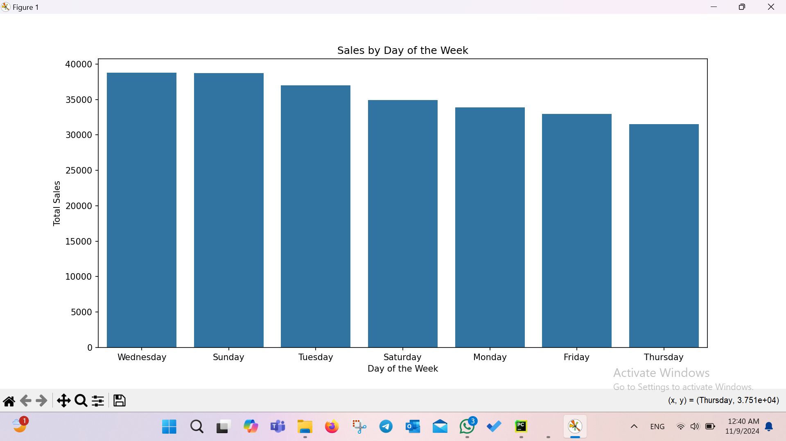

# E-Commerce Data Analysis and Conversion Rate Insights

## Overview

This project aims to analyze a synthetic e-commerce dataset and provide insights into the factors influencing the conversion rate. The analysis focuses on customer behaviors, purchase patterns, and sales trends to deliver actionable recommendations for improving business performance. The dataset includes information about customers, browsing behavior, product categories, and purchase actions.

## Project Components

1. **Dataset Creation:**
   A synthetic dataset of 1,000 records is generated using random data, simulating the behavior of e-commerce users. The dataset contains the following columns:
   - `CustomerID`: Unique identifier for each customer.
   - `SessionID`: Unique session identifier for tracking browsing sessions.
   - `ProductID`: Unique identifier for products.
   - `Category`: Product category (e.g., Electronics, Clothing, etc.).
   - `BrowsingDuration`: Duration (in seconds) the customer spent browsing products.
   - `AddedToCart`: Whether the customer added items to the cart (0 = No, 1 = Yes).
   - `Purchased`: Whether the customer made a purchase (0 = No, 1 = Yes).
   - `PurchaseAmount`: The total purchase amount for a completed transaction.
   - `DiscountApplied`: Whether a discount was applied to the purchase (0 = No, 1 = Yes).
   - `TimeOfDay`: The time of day when the session occurred (Morning, Afternoon, Evening, Night).
   - `DayOfWeek`: The day of the week the session occurred.
   - `DeviceType`: The type of device used (Mobile, Desktop, Tablet).
   - `Source`: The traffic source (Search, Ad, Direct).
   - `CustomerLocation`: The geographical location of the customer (Urban, Suburban, Rural).
   - `CustomerAge`: The age of the customer.
   - `CustomerGender`: The gender of the customer.
   - `CustomerIncome`: The income of the customer.
   - `CustomerType`: Whether the customer is new or returning.

2. **Data Analysis:**
   - **Conversion Rate**: The percentage of sessions that result in a purchase.
   - **Factor Analysis**: Identification of factors that influence conversion rates, such as whether items are added to the cart, the type of device used, and whether discounts are applied.
   - **Sales Prediction**: Analysis of total sales by day of the week to understand patterns and potential trends.

3. **Data Visualization:**
   - A bar plot is generated to visualize the total sales by day of the week.

4. **Recommendations**: Based on the analysis, actionable insights and recommendations are provided to help improve the conversion rate and optimize sales strategies.

---

## Prerequisites

To run the project, you'll need the following Python libraries:

- `pandas`: For data manipulation and analysis.
- `numpy`: For generating random data.
- `matplotlib`: For creating visualizations.
- `seaborn`: For enhanced visualizations.

You can install the required libraries using pip:

```bash
pip install pandas numpy matplotlib seaborn
```

---

## How to Run

1. **Clone or Download the Repository**: Start by cloning or downloading the repository to your local machine.
   
2. **Install Dependencies**: If not already installed, you can install the necessary Python libraries using the following command:
   ```bash
   pip install pandas numpy matplotlib seaborn
   ```

3. **Run the Script**: The script can be run directly in a Python environment. It will generate a synthetic dataset, perform the analysis, and display the results.

```bash
python ecommerce_analysis.py
```

---

## Key Results

### Conversion Rate
The script calculates the overall conversion rate (the percentage of sessions where a purchase was made) and prints it to the console.

```python
Conversion Rate: X.XX%
```

### Factor Analysis

The script performs a group-by operation on several factors (e.g., `AddedToCart`, `DiscountApplied`, `DeviceType`, etc.) and calculates the average purchase rate for each combination. This helps identify factors that are correlated with higher conversion rates.

### Sales by Day of the Week
The script calculates the total sales amount by each day of the week, helping identify trends in purchasing behavior.

The results are visualized in a bar plot:



### Recommendations

Based on the analysis, the script will print out recommendations for improving conversion rates. Example recommendations include:
- Optimizing the checkout flow if the conversion rate is low.
- Revising discount strategies if discounts are overused.
- Focusing on search optimization if ads are a significant traffic source.

---

## Example Output

### Sample Output:

```text
Conversion Rate: 1.83%
Factor Analysis:
AddedToCart  DiscountApplied  DeviceType  Source   CustomerType
0             0                Desktop     Search   Returning       0.25%
1             1                Mobile      Ad       New             8.40%
...
Total sales by day of the week:
DayOfWeek
Friday       35045.60
Saturday     31530.45
Monday       27580.30
...
Recommendations:
- Consider optimizing checkout flow to increase conversion.
- Discounts are highly used, consider revising discount strategies.
- Ads are a significant traffic source, consider focusing on search optimizations.
```

---

## Contributing

Feel free to fork this project, submit issues, and send pull requests. If you have any improvements or additional insights, contributions are welcome!

---

## License

This project is open source and available under the [MIT License](LICENSE).

--- 

## Acknowledgements

- The dataset used in this project is synthetic and generated for analysis purposes.
- This analysis can be extended by using real-world data for further insights.

---

## Conclusion

This project provides a structured approach to analyzing e-commerce data and deriving actionable insights to improve business outcomes. By exploring factors that influence the conversion rate and visualizing sales trends, businesses can make informed decisions to optimize their sales and marketing strategies.